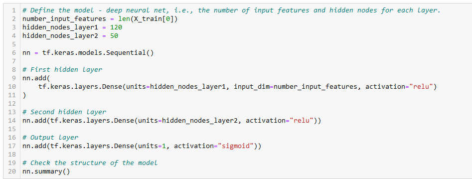
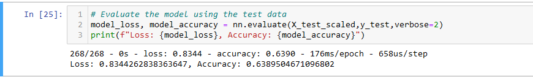
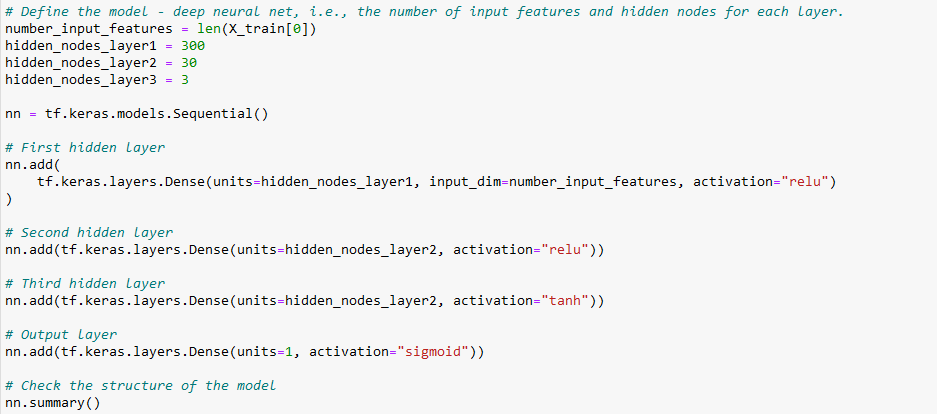

# Neural_Network_Charity_Analysis

## <u>Neural_Network_Charity_Analysis:</u>
### Beks, a data scientist working at Alphabet Soup, has been tasked to analyze the impact of each donation the company makes and vet potential recipients. Andy Glad, Alphabet Soup's president, has asked Beks to predict which organizations are worth donating to. In order to do that, Beks wants us to create a deep learning algorithm that will predict if applicants will be successful if funded by Alphabet Soup.
 

## <u>Results:</u>
 

## 1. Data Preprocessing
 

- ### What variable(s) are considered the target(s) for your model? 
    - #### Our target variable is the "IS_SUCCESSFUL" column. We want to know if the application will be accepted, hence this is our target variable.  
- ### What variable(s) are considered to be the features for your model?
    - #### Our features are the following:   APPLICATION_TYPE',   'AFFILIATION',  'CLASSIFICATION',  'USE_CASE',  'ORGANIZATION',  'INCOME_AMT',  'SPECIAL_CONSIDERATIONS'
- ### What variable(s) are neither targets nor features, and should be removed from the input data?
    - #### The variables that are not relevant to our analysis are the 'EIN' and 'Name' variables.
 

 ## 2. Compiling, Training, and Evaluating the Model
  

- ### How many neurons, layers, and activation functions did you select for your neural network model, and why? 

    

    - #### As can be seen in the image above, I chose to use 2 hidden node layers with 120 and 50 neurons respectively. As for the activation function, I chose the ReLU function. The output layer uses the sigmoid activation function, since we are looking at a binary result. Epoch has been set to 200. The main reason for adding a substantial number of neurons to my layers was because I wanted to make sure that each neuron was able to focus on a distinct feature. It also makes it easier and faster to find the optimal weights by adding multiple neurons to the layers. AS the saying goes, you generally want to have three times the number of neurons in the hidden layers as the number of inputs; inputs being 43 in this case.
    
      
- ### Were you able to achieve the target model performance?
    - #### Unfortunately, I was not able to achieve the target model performance of 75% and above. Our accuracy was roughly 64%.
    
    

      
- ### What steps did you take to try and increase model performance?
    - #### I tried to add a third hidden layer, reduce the number of epochs from 200 to 100, and changed the activation functions from ReLU to tanh. I also tried changing the loss and optimizer model, but to no avail. In addition, I increased and decreased the amount of nodes in hidden layer 1 and 2. All in all, I was not able to increase the accuracy of the model. However, using the ReLU activation function turned out to yield better results than the other functions.
    
  

## <u>Summary:</u>

- ### Overall, the ReLU activation function proved to be the best when trying to classify the results. Increasing the number of neurons per hidden layer increased the performance, however, I was not able to reach the target accuracy value. With an accuracy of 64% the model needs more training to successfully evaluate organizations that would be at high-risk.

- ### In order to increase the accuracy, the model needs more input data. Deep machine learning models are usually more efficient when given huge amounts of data. Therefore, I would recommend using more traditional models, such as SVMs (Support Vector Machine). Especially, since the amount of input data can be less, which should result in a more accurate model. Lastly, one might consider a robust learning model such as the Random Forest Classifier. The advantage being that it is easier and faster to execute than a deep machine learning model.
